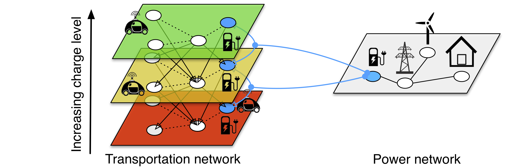
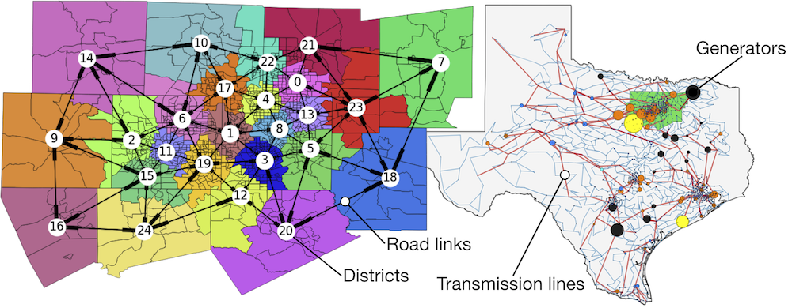
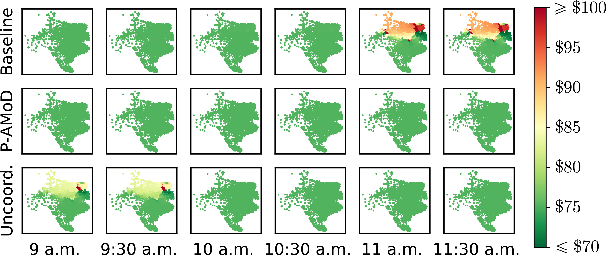

# Coordination Algorithms for Autonomous Mobility-on-Demand systems and the power network.

Code for the paper: Rossi, F., Iglesias, R., Alizadeh, M., and Pavone, M., [_On the interaction between Autonomous Mobility-on-Demand systems and the power network: models and coordination algorithms_](https://arxiv.org/pdf/1709.04906.pdf), Transactions on Control of Networked Systems, 2019 (In Press).

## Requirements

The code base contains both Python 2 code (scenario creation, visualization) and MATLAB code (optimization of the P-AMoD problem, receding-horizon simulation).

The Python requirements are detailed in `requirements.txt`. To install them, `pip install -r requirements.txt`. A virtualenv is highly recommended.

We also use Jupyter notebooks for MATLAB. To install the [MATLAB Jupyter extension](https://github.com/Calysto/matlab_kernel), `pip install matlab_kernel`.

To solve the P-AMoD problem, a LP solver is required in MATLAB. Our implementations supports CPLEX 12.X and MOSEK 8. If neither is available and the MOSEK solver is selected, the solver will fall back to MATLAB's built-in `linprog`.

## Quick Start

### Dallas-Fort Worth Case Study

- run the Jupyter notebook [`DFW_scenario_preparation`](case_studies/Dallas_Fort-Worth/DFW_scenario_preparation.ipynb). The notebook will create a `.mat` file in the folder `case_studies/Dallas_Fort-Worth/scenario/`.

- run the Jupyter notebook [`DFW_PAMoD_solution`](case_studies/Dallas_Fort-Worth/DFW_PAMoD_solution.ipynb) (MATLAB). In the second cell, point the `input_file` path to the file created in the previous step. The notebook will create three `.mat` files in the folder `case_studies/Dallas_Fort-Worth/scenario/`.

- run the Jupyter notebook [`DFW_scenario_visualization`](case_studies/Dallas_Fort-Worth/DFW_scenario_visualization.ipynb). In the third cell, point the variables `coordinated_input_file` and `uncoordinated_input_file` to the corresponding files created in the previous step. The notebook will create a number of inline plots, including the plots in the paper.

### Receding-horizon controller

- run the Jupyter notebook [DFW_scenario_creation.ipynb](case_studies/Dallas_Fort-Worth/DFW_scenario_creation.ipynb). The notebook will create a `.mat` file in the folder `case_studies/Dallas_Fort-Worth/scenario/`.

- run the MATLAB script [`dfw_test_sim_driver.m`](receding_horizon_simulation/dfw_test_sim_driver.m) in [receding_horizon_simulation](receding_horizon_simulation). Make sure to point the `fileName.dataName` on line 12 to the `.mat` file created in the previous step. The controller is randomized, so some variation between executions is expected: to choose the number of simulations to run, set the variable `NUM_SIMS` on line 9 of the script. The script will create three .mat files for each simulation run, for a P-AMoD simulation, uncoordinated simulation, and baseline (no cars) simulation respectively.

- to compare the performance of multiple rebalancing strategies, run the Jupyter notebook [`receding_horizon_sim_reader`](receding_horizon_simulation/results/receding_horizon_sim_reader.ipynb) in the [`receding_horizon_simulation/results`](receding_horizon_simulation/results) folder.

- to create a timelapse video, make sure to set `controllerSettings.VideoLog=1` in[`dfw_test_sim_driver.m`](receding_horizon_simulation/dfw_test_sim_driver.m) (this will result in a much larger log file). Once the simulation is completed, run the notebook [`receding_horizon_timelapse_visualizer`](receding_horizon_simulation/results/receding_horizon_timelapse_visualizer.ipynb) in the [`receding_horizon_simulation/results`](receding_horizon_simulation/results) folder. Make sure to set the variable `RTFile` to the log of the simulation you wish to plot in the second cell of the notebook.

## P-AMoD problem

The folder [solvers](solvers) contains MATLAB implementation of the P-AMoD problem presented in the paper above. Two implementations are provided:

- [`TVPowerBalancedFlow_withpower_sinkbundle`](solvers/TVPowerBalancedFlow_withpower_sinkbundle.m) implements the P-AMoD problem presented in the TCNS paper;

- [`TVPowerBalancedFlow_realtime`](solvers/TVPowerBalancedFlow_realtime.m) implements the lower-dimensional version of the P-AMoD problem presented in the appendix of the TCNS paper and detailed in the Extended Version on arXiv.

Both solvers have extensive inline documentation.

## Performance

We recommend running the code in this repository on a machine with at least 64 GB of RAM (e.g., AWS m5.4xlarge).

Optimizing the P-AMoD problem relies on solving very large linear programs with several millions of variables. Creating the Dallas-Fort Worth case study also relies on manipulating very large NetworkX graphs. Both of these applications are extremely RAM-hungry.

Conversely, the receding-horizon simulations (which rely on solving a significantly smaller and simpler optimization problem) can also run on a modern laptop (16GB RAM) with reasonably good performance.

## License

MIT License

Copyright (c) 2018 Stanford University Autonomous Systems Laboratory

Permission is hereby granted, free of charge, to any person obtaining a copy
of this software and associated documentation files (the "Software"), to deal
in the Software without restriction, including without limitation the rights
to use, copy, modify, merge, publish, distribute, sublicense, and/or sell
copies of the Software, and to permit persons to whom the Software is
furnished to do so, subject to the following conditions:

The above copyright notice and this permission notice shall be included in all
copies or substantial portions of the Software.

THE SOFTWARE IS PROVIDED "AS IS", WITHOUT WARRANTY OF ANY KIND, EXPRESS OR
IMPLIED, INCLUDING BUT NOT LIMITED TO THE WARRANTIES OF MERCHANTABILITY,
FITNESS FOR A PARTICULAR PURPOSE AND NONINFRINGEMENT. IN NO EVENT SHALL THE
AUTHORS OR COPYRIGHT HOLDERS BE LIABLE FOR ANY CLAIM, DAMAGES OR OTHER
LIABILITY, WHETHER IN AN ACTION OF CONTRACT, TORT OR OTHERWISE, ARISING FROM,
OUT OF OR IN CONNECTION WITH THE SOFTWARE OR THE USE OR OTHER DEALINGS IN THE
SOFTWARE.
